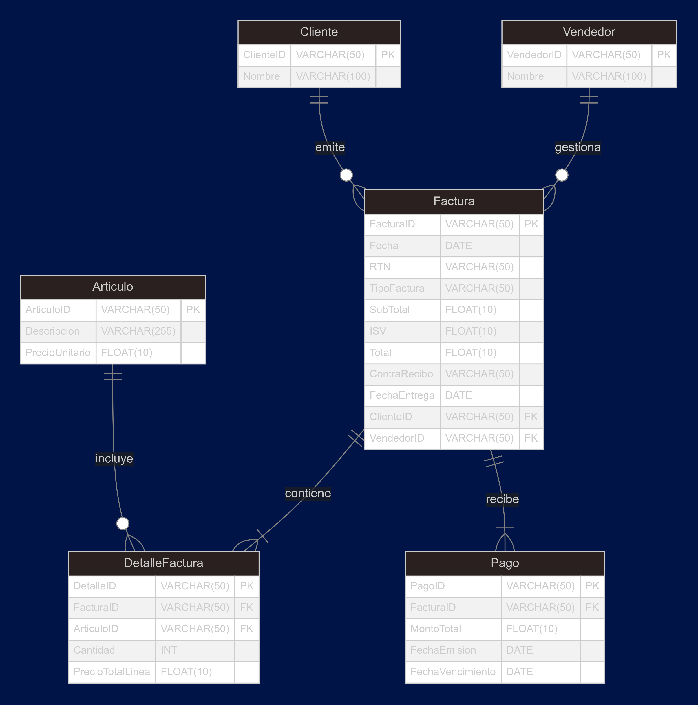

# Proyecto de Base de Datos: Sistema de Facturación

## Descripción del Proyecto
Este proyecto implementa un sistema de facturación utilizando una base de datos relacional. El diseño incluye entidades como **Cliente**, **Empleado**, **Producto**, **Factura** y **Detalle_Factura**, y se ha desarrollado en varias fases para garantizar una estructura modular y bien organizada.

El sistema permite:
- Registrar clientes, empleados y productos.
- Emitir facturas con detalles de los productos comprados.
- Consultar información completa sobre las facturas, incluyendo relaciones entre todas las entidades.

## Estructura del Proyecto
A continuación, se describe el contenido de cada archivo en este repositorio:

1. **ERM_factura.png**: Diagrama Entidad-Relación (ER) que muestra las entidades principales y sus relaciones [[4]].
2. **s2_campos.sql**: Script SQL que define las entidades con sus campos, pero sin relaciones ni claves foráneas.
3. **s3_relacionesYllaves.sql**: Script SQL que agrega las relaciones y claves foráneas a las tablas.
4. **s4_llenadoEntidades.sql**: Script SQL que inserta datos de prueba en las tablas.
5. **s5_generalQuery.sql**: Consulta SQL que une todas las entidades y muestra los datos relacionados.

## Diagrama Entidad-Relación
A continuación, se muestra el diagrama Entidad-Relación del sistema:

---

## Integrantes del Equipo
Este proyecto fue desarrollado por los siguientes integrantes:

1. **🧮Manuel Parra🧮: Matemático**
2. **💻Sebastián Vargas💻: Ingeniero de Sistemas**
3. **💻Julián Moreno💻: Ingeniero de Sistemas**
4. **💻Danna Vega💻: Ingeniera de Sistemas**
---
## Ejecución del Proyecto
Para ejecutar este proyecto, sigue los pasos a continuación:

1. **Configuración del Entorno**:
   - Asegúrate de tener instalado SQLite o cualquier otro motor de base de datos compatible.
   - Clona este repositorio en tu máquina local.

2. **Ejecución de Scripts**:
   - Ejecuta los scripts SQL en el siguiente orden:
     1. `s2_campos.sql`: Crea las tablas con sus campos.
     2. `s3_relacionesYllaves.sql`: Agrega las relaciones y claves foráneas.
     3. `s4_llenadoEntidades.sql`: Inserta datos de prueba.
     4. `s5_generalQuery.sql`: Ejecuta la consulta general para ver los datos relacionados.
