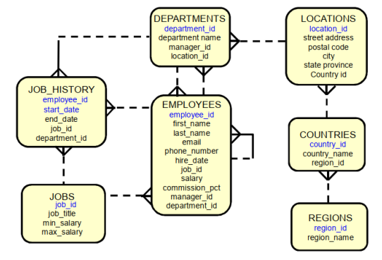

# Taller de Repaso: Queries en Oracle Human Resources

## Diagrama Entidad-Relación

A continuación, se muestra el diagrama Entidad-Relación del sistema:

## ❓❓ Preguntas y Respuestas 💡💡

1. Seleccione todos los datos de la tabla `EMPLOYEES`.
2. Seleccione solo el nombre, apellido y salario de los empleados.
3. Seleccione los empleados que tienen un salario mayor a 5000.
4. Seleccione los empleados que trabajan en el departamento 50 o 80.
5. Seleccione los empleados cuyo apellido empieza con la letra A.
6. Seleccione los empleados que tienen un cargo de manager o director.
7. Seleccione los empleados que tienen una fecha de contratación entre el 1 de enero de 2000 y el 31 de diciembre de 2010.
8. Seleccione los empleados que tienen un apellido que contiene la letra E.
9. Seleccione los empleados que tienen un nombre que termina en A o en O.
10. Seleccione los empleados que no trabajan en el departamento 10 ni en el 20.
11. Seleccione los empleados que tienen un salario entre 3000 y 6000, ambos inclusive.
12. Obtenga el nombre y el número de teléfono de todos los empleados que tienen un número de teléfono que comienza con el prefijo 555.
13. Obtenga el nombre y el correo electrónico de todos los empleados que tienen una dirección de correo electrónico que termina con el dominio `.com`.
14. Obtenga todos los nombres de los empleados que su nombre contiene la palabra 'Smith'.

## Integrantes del Equipo

Este proyecto fue desarrollado por los siguientes integrantes:

1. **🧮 Manuel Parra 🧮: Matemático**
2. **💻 Sebastián Vargas 💻: Ingeniero de Sistemas**
3. **💻 Julián Moreno 💻: Ingeniero de Sistemas**
4. **💻 Danna Vega 💻: Ingeniera de Sistemas**
