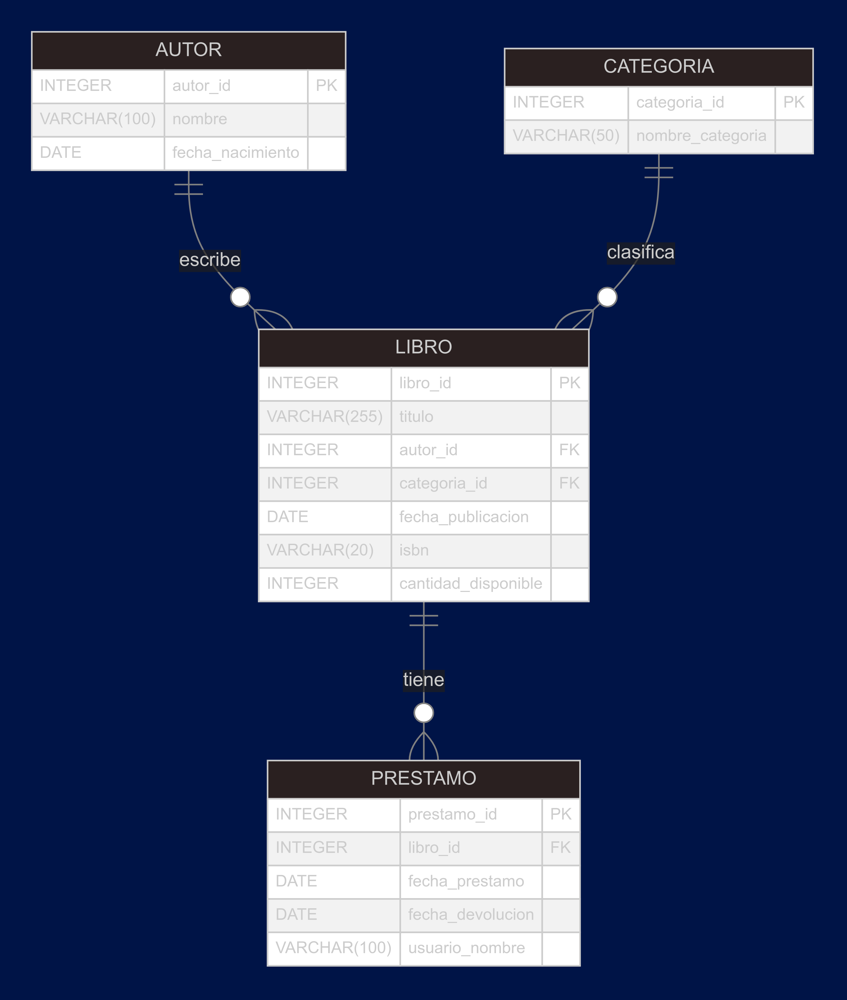

# Proyecto de Base de Datos: Gestión de Biblioteca

## Descripción del Proyecto
Este proyecto implementa un sistema de gestión de biblioteca utilizando una base de datos relacional. El diseño incluye entidades como **Autores**, **Categorías**, **Libros** y **Préstamos**, y se ha desarrollado en varias fases para garantizar una estructura modular y bien organizada.

El sistema permite:
- Registrar autores, categorías y libros.
- Gestionar préstamos de libros.
- Consultar información completa sobre los libros y sus préstamos, incluyendo relaciones entre todas las entidades.

## Estructura del Proyecto
A continuación, se describe el contenido de cada archivo en este repositorio:

1. **ERM_biblioteca.png**: Diagrama Entidad-Relación (ER) que muestra las entidades principales y sus relaciones.
2. **s1_schema.sql**: Script SQL que define las entidades con sus campos, pero sin relaciones ni claves foráneas.
3. **s2_relationsFK.sql**: Script SQL que agrega las relaciones y claves foráneas a las tablas.
4. **s3_fillment.sql**: Script SQL que inserta datos de prueba en las tablas.
5. **s4_queries.sql**: Script SQL que responde a las preguntas exploratorias.

## Diagrama Entidad-Relación
A continuación, se muestra el diagrama Entidad-Relación del sistema:

## Transformaciones a 3NF

### Entidad: Autores
- **Transformación**: La entidad **Autores** ya está en 3NF, ya que todos sus atributos dependen únicamente de la clave primaria `autor_id`.

### Entidad: Categorías
- **Transformación**: La entidad **Categorías** también está en 3NF, con todos sus atributos dependiendo exclusivamente de `categoria_id`.

### Entidad: Libros
- **Transformación**: Se aseguró que todos los atributos no clave dependan únicamente de la clave primaria `libro_id`. Las relaciones con **Autores** y **Categorías** se mantienen mediante claves foráneas.

### Entidad: Préstamos
- **Transformación**: La entidad **Préstamos** está en 3NF, con todos sus atributos dependiendo de `prestamo_id` y manteniendo una relación con **Libros** a través de una clave foránea.

## ❓❓ Preguntas y Respuestas 💡💡

### 1. ¿Cuáles son los títulos de los libros de la categoría 'Ficción’?

| Título                          |
|---------------------------------|
| Cien años de soledad            |
| La casa verde                   |
| La casa de los espíritus       |
| Kafka en la orilla              |
| El viejo y el mar               |

### 2. ¿Cuántos libros están disponibles de cada autor?

| Nombre                      | Total Disponibles |
|-----------------------------|-------------------|
| Gabriel Garcia Marquez      | 10                |
| Mario Vargas Llosa          | 5                 |
| J.K. Rowling                 | 8                 |
| George Orwell                | 12                |
| Isabel Allende               | 7                 |
| Haruki Murakami              | 9                 |
| Agatha Christie              | 6                 |
| Stephen King                 | 4                 |
| Jane Austen                  | 11                |
| Ernest Hemingway             | 3                 |

### 3. ¿Qué libros fueron publicados después del año 2000?

| Título                  | Fecha Publicación |
|-------------------------|-------------------|
| Kafka en la orilla      | 2002-01-01        |

### 4. ¿Cuántos préstamos se han realizado de cada libro?

| Título                          | Total Préstamos |
|---------------------------------|------------------|
| Cien años de soledad            | 1                |
| La casa verde                   | 1                |
| Harry Potter y la piedra filosofal | 1                |
| 1984                            | 1                |
| La casa de los espíritus       | 1                |
| Kafka en la orilla              | 1                |
| Asesinato en el Orient Express | 1                |
| It                              | 1                |
| Orgullo y prejuicio            | 1                |
| El viejo y el mar               | 1                |

### 5. ¿Quiénes han prestado libros de la categoría 'Ciencia Ficción'?

**Respuesta:** SQL query successfully executed. However, the result set is empty.

### 6. ¿Cuál es el autor que tiene la mayor cantidad de libros disponibles en total?

| Nombre          | Total |
|-----------------|-------|
| George Orwell  | 12    |

### 7. ¿Qué libros han sido prestados más de 5 veces y tienen más de 3 copias disponibles?

**Respuesta:** SQL query successfully executed. However, the result set is empty.

### 8. ¿Cuál es el libro más reciente de cada categoría?

| Categoría       | Título                          | Fecha          |
|-----------------|---------------------------------|----------------|
| Fantasia        | Harry Potter y la piedra filosofal | 1997-06-26     |
| No Ficcion      | 1984                            | 1949-06-08     |
| Ficcion         | Kafka en la orilla              | 2002-01-01     |
| Misterio        | Asesinato en el Orient Express | 1934-01-01     |
| Terror          | It                              | 1986-09-15     |
| Romantico       | Orgullo y prejuicio            | 1813-01-28     |

### 9. ¿Qué autores tienen libros que fueron publicados antes de 1990 y tienen al menos un libro disponible?

| Nombre                      |
|-----------------------------|
| Gabriel Garcia Marquez      |
| Mario Vargas Llosa          |
| George Orwell               |
| Isabel Allende              |
| Agatha Christie             |
| Stephen King                |
| Jane Austen                 |
| Ernest Hemingway            |

### 10. ¿Cuántos libros de cada autor han sido prestados más de 3 veces en total, y cuántos están disponibles actualmente?

**Respuesta:** SQL query successfully executed. However, the result set is empty.

## Integrantes del Equipo
Este proyecto fue desarrollado por los siguientes integrantes:

1. **🧮 Manuel Parra 🧮: Matemático**
2. **💻 Sebastián Vargas 💻: Ingeniero de Sistemas**
3. **💻 Julián Moreno 💻: Ingeniero de Sistemas**
4. **💻 Danna Vega 💻: Ingeniera de Sistemas**

## Ejecución del Proyecto
Para ejecutar este proyecto, sigue los pasos a continuación:

1. **Configuración del Entorno**:
   - Asegúrate de tener instalado SQLite o cualquier otro motor de base de datos compatible.
   - Clona este repositorio en tu máquina local.

2. **Ejecución de Scripts**:
   - Ejecuta los scripts SQL en el siguiente orden:
     1. `s1_schema.sql`: Crea las tablas con sus campos.
     2. `s2_relationsFK.sql`: Agrega las relaciones y claves foráneas.
     3. `s3_fillment.sql`: Inserta datos de prueba.
     3. `s4_queries.sql`: Responde a las preguntas exploratorias.
 
